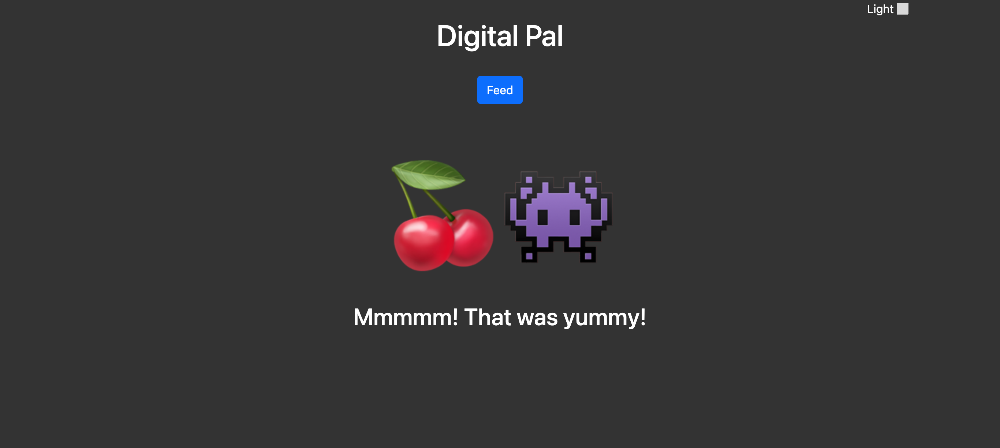

# Digital Pal 👾

## Description

This is a retro digital-pet app from the 90's! Feed your pet or take it outside!

[🚀 https://digital-pal.netlify.app/](https://digital-pal.netlify.app/)

## Table of Contents

- [Image](#image)
- [Technologies](#technologies)
- [Known-Bugs](#known-bugs)
- [Next-Steps](#next-steps)
- [License](#license)
- [Contact](#contact)
- [Links](#links)

## Technologies

- React.js
- Vite.js
- Javascript
- HTML
- CSS
- Bootstrap
- Netlify

## Image

## Known-Bugs

There may be issues with the flow of the game.

## Next-Steps

- Score
- Notifications
- Game over

## License

This project is licensed under the [MIT](https://opensource.org/licenses/MIT) license.

## Contact

Author: Ray Luna

If you have any questions about the repo, open an issue or contact me directly at:

- E-Mail: leon.luna.ray@gmail.com
- GitHub: [leon-luna-ray](https://github.com/leon-luna-ray)

## Links

- [Deployed Project](https://digital-pal.netlify.app/)

- [Project Repository](https://github.com/leon-luna-ray/digital-pal)
